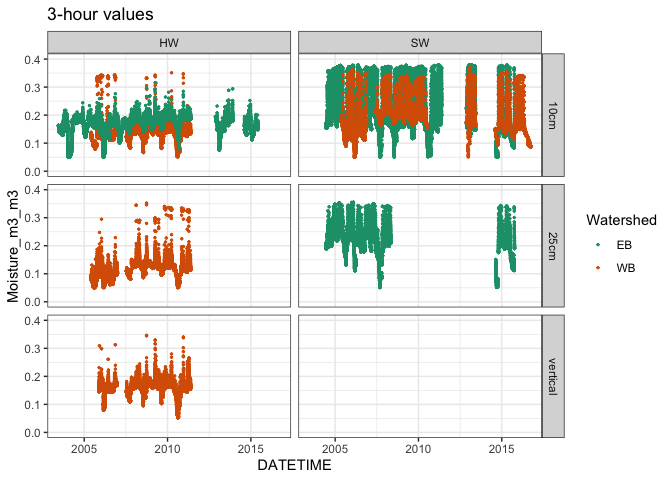
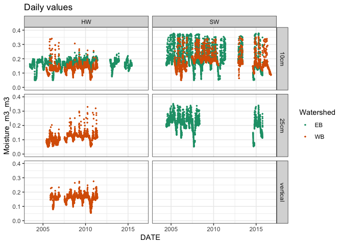
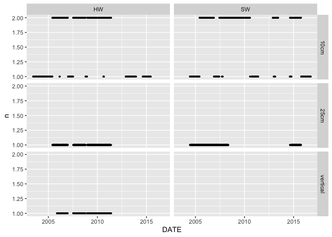

HOBO data for soil moisture - Bear Brook Watershed in Maine
================
Kaizad Patel

Run: 2020-01-28

## metadata

|                          |                                    |
| ------------------------ | ---------------------------------- |
| Site                     | The Bear Brook Watershed in Maine  |
| Location                 |                                    |
| Variable measured        | soil moisture                      |
| Units of measurement     | m3/m3, volumetric moisture content |
| Instruments used         | HOBO                               |
| Depth in soil            | 10 cm, 25 cm in mineral soil       |
| Period of measurement    | 2003-2016                          |
| Frequency of measurement | 3 hours                            |
| Frequency of data        | 3 hours, daily                     |

## 3-hour values

<!-- -->

## daily values

<!-- -->

## number of data points

<!-- -->
